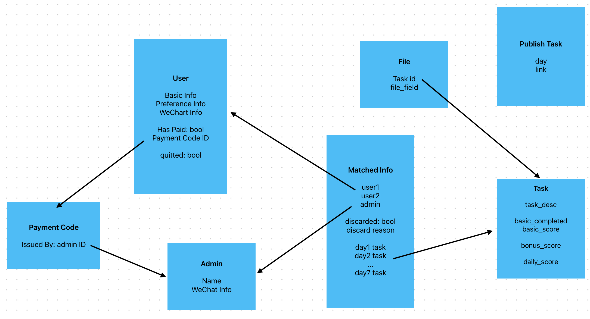

# Triple Uni 2025年一周CP活动

## 文件结构
 - `./frontend/website` 前端网页
 - `./backend/server` 后端服务器
 - `./backend/wechat-oauth` 微信 OAuth2.0 代理
 - `./backend/mathingAlgorithm` 配对算法

## 业务流程
### 1. 用户通过问卷报名
报名时会收集的数据：  
 - 基础信息： 自己的 姓名/ 性别/ 学校/ 年级/ MBIT/ ...  
 - 偏好信息： 对方的 性别/ 学校/ 年级/ MBTI/ ...  
 - 联系信息： 自己的 邮箱/ 微信号/ ...  
 - 补充信息： 其他要求/ 想说的/ ...  
 - 通过微信登录收集的： 微信头像/ 微信昵称/ OpenID（用于之后的用户登录）  

### 2. 报名截止后开始匹配
通过Hungarian algorithm进行加权二分图最优计算  
**需要尝试调整不同的匹配权重找到最合适的匹配**

### 3. 用户通过网页查询匹配结果并支付押金
具体步骤如下：  
 1. 通过微信登录网站查看是否入选（可以通过微信通知/ 邮件形式提醒入选用户）
    - 没有在第一批入选的用户会被提示仍有可能会在第二批被选中
 2. 网页展示【财务】的微信二维码/ 微信号，要求用户添加并支付押金
 3. 支付押金后【财务】会向用户发送一个一次性二维码，用户扫描后转跳至网站并展示配对对象的微信头像及昵称  
    - 用户有一次可以选择【我认识对方， 要求重新匹配】的机会。将会提示用户第二轮有可能不被匹配到或是仍然匹配到同一人
    - 若配对双方都不选择重新匹配，则默认匹配成功，等待活动开始

### 4. 进行第二轮匹配
匹配池为：
 - 第一轮未被匹配到的用户
 - 第一轮匹配到但是要求重新匹配的双方
 - 第一轮匹配到但是对方没有缴纳押金的被鸽方

### 5. 用户查看第二轮匹配结果
具体步骤与第**3**步类似，除了：
 - 已经缴纳押金的用户可以直接查看匹配对象的头像
 - 已经缴纳押金但是第二轮匹配失败的用户需要退还押金

### 6. 活动正式开始
#### 6.1 用户
活动开始后，用户可以登录网站并查看对方的微信号并自行添加（可以通过微信通知/ 邮件形式提醒配对成功的用户）  
 - 需要在网页上提醒用户每天登录网站查看当日任务  
 - 用户需要每天在网站上提交当天的任务凭证 （可以通过微信通知/ 邮件形式提醒在接近ddl还未的配对双方）  
 - 用户双方只需要提交一次即可
 - 用户双方需要可以查看提交内容

#### 6.2 Mentor
活动开始后，Mentor需要定时在后台系统审核所有的任务是否完成并记分

#### 6.3 特殊情况
待补充...

### 7. 活动结束
后台自动计算每组总得分并给出排名  
财务根据任务完成情况退还押金

# 数据库设计
